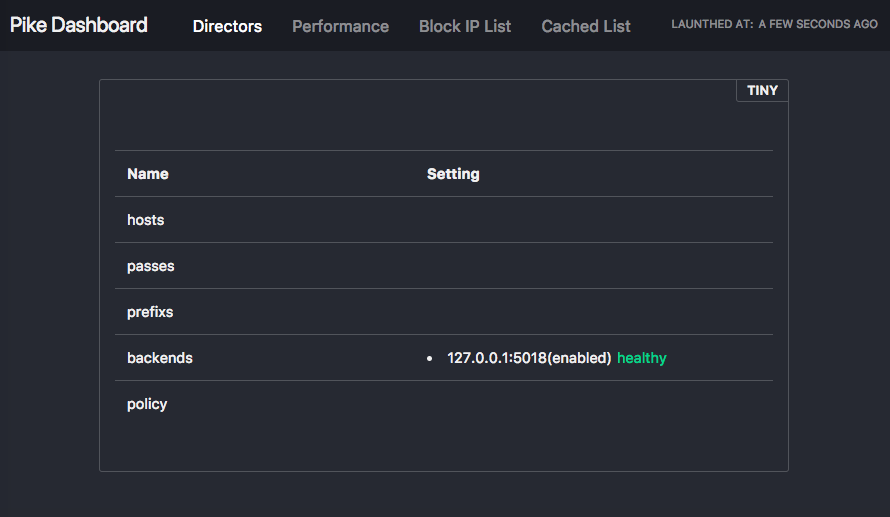
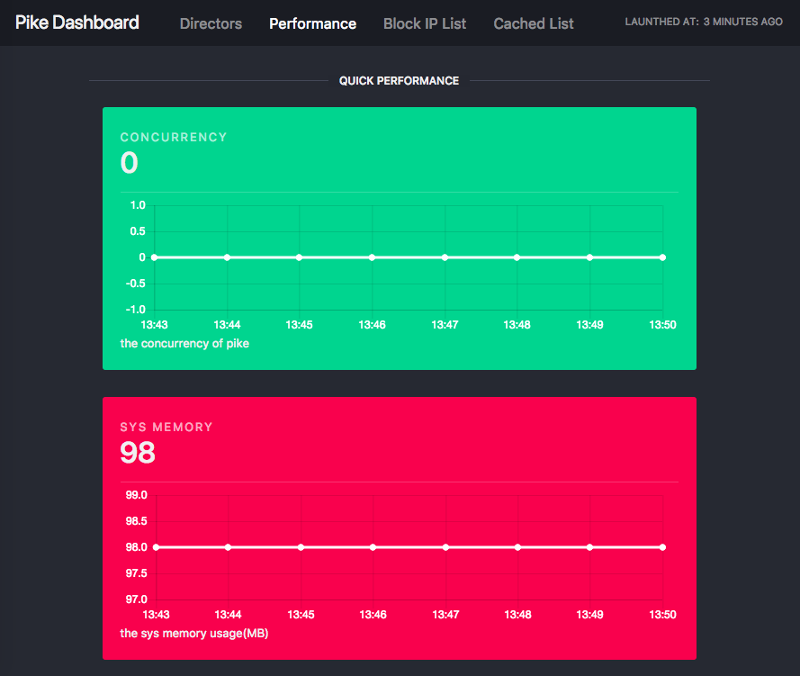
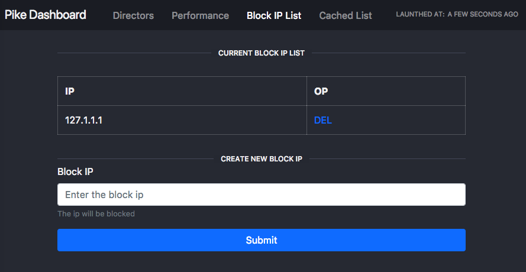
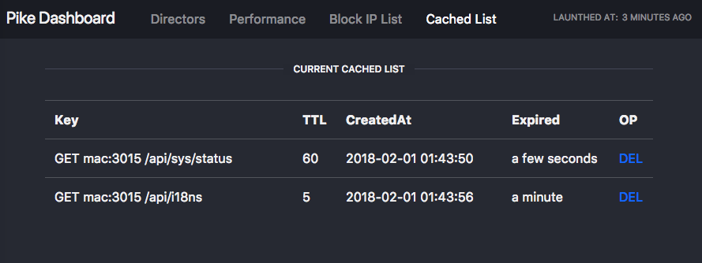

在此主要通过最简单的方式来介绍如何使用Pike，此示例只讲解如何编写配置文件，启动缓存服务。

## 配置

Pike的配置文件使用yaml的形式，它理直观易懂，下面使用最简化的配置形式

```yaml
# 程序监听的端口，默认为 :3015
listen: :3015
# 数据缓存的db目录，默认为 /tmp/pike
db: /tmp/pike
# 后台管理员页面路径，如果不配置，无法使用管理员功能
adminPath: /pike
# 管理员验证token
adminToken: ry3WwvhVG
directors:
  -
    # 名称
    name: tiny 
    # backend的健康检测，如果不配置，则不做检测，默认backend都为正常
    ping: /ping
    # backend列表
    backends:
      - 127.0.0.1:5018
```

```bash
./pike -c ./config.yml

docker -d --restart=always -p 3015:3015 -v ./config.yml:/etc/pike/config.yml vicanso/pike
```

## 程序管理界面

在成功启动之后，可以打开管理界面（首次打开会要求输入admin token） `http://127.0.0.1:3015/pike/admin/index.html`：

### directors

- director对应的`host`, `prefix`, `pass`, `policy`规则
- director对应的backends的IP、端口以及健康检测的状态 



### performance

应用性能相关指标，有并发量、内存占用、缓存数据等



### block ip

提供禁止访问IP功能，能快速的对恶意访问IP做屏蔽



### cached

实时查看当前已缓存数据的创建时间、过期时间以及删除缓存数据功能



